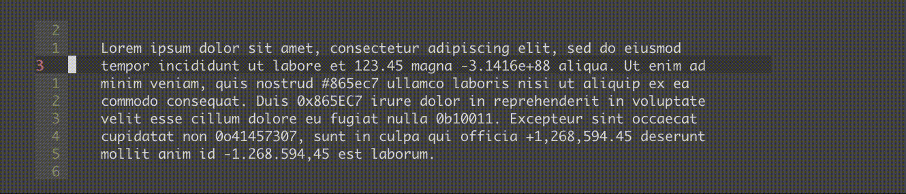

  <h1>vim-numbers</h1>
  
Text objects for numbers

  

    
    
    
    
  

A small plugin that provides text objects for integral or floating-point numbers
(with or without scientific notation) and binary, hexadecimal and octal numbers.

## Installation

* [Pathogen](https://github.com/tpope/vim-pathogen):
  `git clone https://github.com/MisanthropicBit/vim-numbers ~/.vim/bundle/vim-numbers`
* [NeoBundle](https://github.com/Shougo/neobundle.vim):
  `NeoBundle 'MisanthropicBit/vim-numbers'`
* [VAM](https://github.com/MarcWeber/vim-addon-manager):
  `call vam#ActivateAddons(['MisanthropicBit/vim-numbers'])`
* [Vundle](https://github.com/VundleVim/Vundle.vim):
  `Plugin 'MisanthropicBit/vim-numbers'`
* [vim-plug](https://github.com/junegunn/vim-plug):
  `Plug 'MisanthropicBit/vim-numbers'`

## Similar Projects

* [tkhren/vim-textobj-numeral](https://github.com/tkhren/vim-textobj-numeral)
